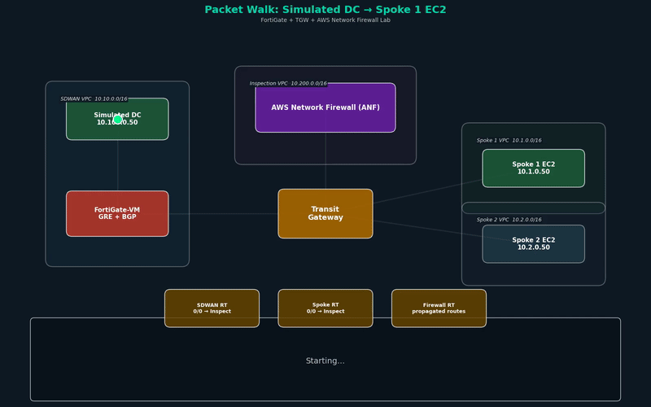
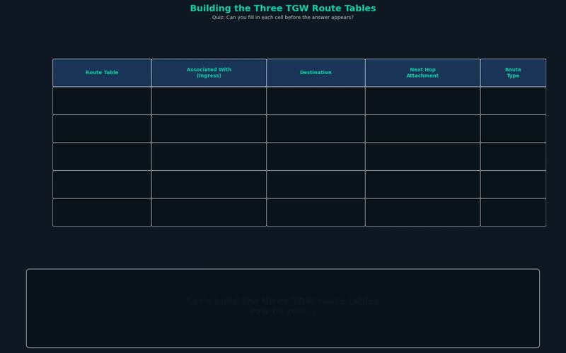

# FortiGate + TGW + AWS Network Firewall Lab

Deploys a FortiGate-VM (BYOL) in AWS with TGW Connect (GRE + BGP) and a centralized Inspection VPC running AWS Network Firewall. This guide assumes you have never used Terraform or the AWS CLI before.

---

## Why This Lab Exists

Enterprise customers increasingly want to run their SD-WAN fabric into AWS the same way they run it everywhere else: terminate branches on a FortiGate, plug that FortiGate into the cloud network, and let workloads in AWS talk to on-prem sites through the same routing, policy, and visibility plane they already trust. At the same time, those customers have internal security teams mandating that all traffic — east-west between VPCs and north-south between AWS and the data center — pass through a central inspection point before reaching its destination.

Done right, these two requirements fit together cleanly. Done wrong, you end up with asymmetric routing, inspection bypasses, policy gaps, and finger-pointing between the network and security teams. As Fortinet SEs, we get asked to whiteboard this design constantly, and customers expect us to have working answers — not just architecture diagrams.

This lab exists so that any Fortinet SE can stand up the full design in under 15 minutes, break things on purpose, and walk into a customer meeting having actually built it. Reading a reference architecture is not the same as watching BGP come up between a FortiGate and a Transit Gateway, or watching a ping silently fail because appliance mode was off on the wrong attachment. Hands-on experience is what separates an SE who describes the design from one who owns it.

## What This Lab Builds


*For a higher-resolution view, open [packet_walk.mp4](packet_walk.mp4) directly.*

A minimal-but-complete version of the most common Fortinet-in-AWS hybrid design pattern:

1. **A FortiGate-VM in a dedicated "SDWAN VPC"**, acting as the cloud-side SD-WAN hub. In a real deployment it would terminate IPsec tunnels from on-prem FortiGates at branches and data centers; here we simulate the on-prem side with a test EC2 so we can focus on the AWS-side mechanics.

2. **An AWS Transit Gateway with a Connect attachment to the FortiGate.** Connect attachments are AWS's purpose-built mechanism for letting third-party network appliances participate in TGW routing as a BGP peer via a GRE tunnel. This is how the FortiGate learns about AWS VPC CIDRs and advertises on-prem CIDRs back into AWS — exactly like a CE router in an MPLS L3VPN.

3. **A centralized Inspection VPC running AWS Network Firewall (ANF)** with endpoints in two Availability Zones. All east-west spoke traffic and all north-south DC-to-AWS traffic is forced through ANF before reaching its destination. Appliance mode on the Inspection VPC's TGW attachment guarantees flow symmetry so stateful inspection works correctly.

4. **Two spoke VPCs with test EC2 instances**, to validate east-west traffic actually traverses ANF instead of short-cutting directly through the TGW.

5. **A three-route-table TGW design** that enforces the "force everything through inspection" policy using ingress-attachment-based routing (the TGW equivalent of VRF + PBR). Two of the three route tables contain a single static default route each; the third is populated entirely by BGP propagation.

**What the lab is not:** a production-ready reference architecture. There's no HA FortiGate pair, no real on-prem IPsec tunnel, no ADVPN, no centralized egress, only two spokes instead of five, and the ANF policy is deliberately permissive so you can get pings flowing before you start locking things down. Every one of these simplifications was a deliberate trade-off to keep the lab cheap (~$12/day), fast to stand up, and focused on the two things that actually matter: (1) watching BGP come up between a FortiGate and a TGW Connect attachment, and (2) proving that multi-route-table TGW routing actually forces traffic through inspection.

## How It Works (At a Glance)

1. **Terraform provisions the entire AWS environment** — four VPCs (SDWAN, Inspection, Spoke 1, Spoke 2), a Transit Gateway with three route tables, all attachments, the FortiGate-VM, AWS Network Firewall with a permissive starter policy, test EC2s, and a $50/month budget alert. Everything is in a single `terraform apply` so you can tear it all down just as easily with `terraform destroy`.

2. **You SSH into the FortiGate once after deployment and paste in a GRE tunnel + BGP neighbor config** from `fortigate-cli.txt`. Terraform intentionally does not configure the FortiGate itself — this step is where you actually learn how the FortiGate talks to the TGW, and it's the single most important hands-on exercise in the lab.

3. **You validate the design by sending pings** between spoke test EC2s and between the simulated DC host and the spokes, confirming via ANF flow logs that every packet was inspected. Then you deliberately break appliance mode and watch return traffic drop — the single most common production failure mode of this design.

4. **When you're done for the day, you destroy everything with one command.** No lingering resources, no surprise bills, nothing to clean up manually.

<details>
<summary><b>Why the FortiGate Needs Two TGW Attachments</b></summary>

When you wire the FortiGate into the Transit Gateway, you create two attachments in a specific order:

1. **A standard VPC attachment** (the "transport" attachment) between the SDWAN VPC and the TGW. This is a normal TGW VPC attachment like the one every spoke has — ENIs in SDWAN VPC subnets, TGW on the other end, IP packets flowing between them.

2. **A Connect attachment layered on top of the VPC attachment.** The Connect attachment is a logical attachment — it doesn't have its own ENIs. Instead, it rides inside the transport VPC attachment as a GRE tunnel, with BGP running inside the GRE tunnel.

You cannot create the Connect attachment first because it needs the VPC attachment to ride on. That's why Terraform creates them in order: VPC attachment → Connect attachment → GRE peers → BGP.

Why two instead of one? Because they do completely different jobs:

- **The VPC attachment is a data plane construct.** It gets GRE-encapsulated bytes from the FortiGate's ENI into the TGW. Think of it as a pipe.
- **The Connect attachment is a control plane construct.** It's the BGP peer that the FortiGate talks to. It's what gets associated with the SDWAN RT and propagated into the Firewall RT. Think of it as the routing relationship.

The mental model: **the VPC attachment moves bytes, the Connect attachment moves routes.** You need both, and you create them in that order.

**Critical: both the VPC (transport) attachment AND the Connect attachment must be associated with the SDWAN route table.** It's tempting to associate only the Connect attachment because that's where BGP runs — but the VPC attachment also needs an associated RT, otherwise traffic originated by the FortiGate's trust ENI hits TGW with no route table to consult and is silently black-holed. The current `tgw.tf` includes both associations.

**Critical: you must propagate the Connect attachment into the TGW's Firewall RT.** The FortiGate learns DC routes from on-prem (over IPsec in production, or via a static loopback in this lab) and re-advertises them to the TGW over the BGP session running inside the Connect attachment. But BGP peering alone isn't enough — without propagating the Connect attachment into the TGW's Firewall RT, those advertised routes are never installed in the route table, and post-inspection return traffic to the data center silently black-holes. This is the step AWS admins most commonly miss because it's a manual click in the console (or a dedicated Terraform resource), not something that happens automatically when BGP comes up.

</details>

<details>
<summary><b>Why Three Route Tables? (The Core Concept)</b></summary>


*For a higher-resolution view, open [route_tables.mp4](route_tables.mp4) directly.*

If you come from traditional networking, think of it this way: a TGW route table is a VRF, an association is an interface-to-VRF binding, and the whole design is just policy-based routing with a cloud paint job.

TGW forwarding works in two steps:

1. **Which route table do I use?** Determined by the association of the attachment the packet arrived on.
2. **Where do I send it?** Longest-prefix-match in that table returns a next-hop attachment.

The powerful consequence: the same destination IP gets forwarded completely differently depending on which attachment the packet arrived on. A packet to `10.1.0.50` arriving on the Connect attachment hits the SDWAN RT and gets sent to Inspection. The exact same destination arriving on the Inspection attachment hits the Firewall RT and goes directly to Spoke 1. That asymmetry is what makes service chaining through a central inspection point possible.

The three tables:

- **SDWAN RT** — associated with the Connect attachment AND the SDWAN VPC attachment. One static default route to the Inspection VPC attachment. Everything from the FortiGate (whether arriving via the GRE tunnel from on-prem or originated by the trust ENI) goes through inspection.
- **Spoke RT** — associated with both spoke VPC attachments. One static default route to the Inspection VPC attachment. Spoke CIDRs are deliberately *not* propagated here — if they were, longest-prefix-match would beat the default and spoke-to-spoke traffic would bypass ANF.
- **Firewall RT** — associated with the Inspection VPC attachment. This is the only "smart" table. After ANF inspects a packet, the Firewall RT decides where it goes: to a spoke (propagated routes), to the FortiGate (DC CIDR learned via BGP through the Connect attachment), or to the SDWAN VPC trust subnet (propagated). No static routes needed.

The design pattern: **"dumb ingress tables + one smart post-inspection table."** Topology belongs in propagation, policy belongs in static routes.

**Appliance mode** is the last critical piece. The Inspection VPC has ANF endpoints in two AZs, and TGW needs to send both halves of every flow to the same AZ endpoint — otherwise ANF's stateful engine drops the return traffic. Appliance mode (enabled on the Inspection VPC attachment only) uses a symmetric hash to guarantee this. Forgetting it is the #1 cause of "worked in testing, broke in production" incidents.

**Terraform mechanics:** in the `.tf` files, propagated routes use `aws_ec2_transit_gateway_route_table_propagation` (TGW installs routes automatically), while static routes use `aws_ec2_transit_gateway_route` (you specify the next-hop explicitly). Two different resources, same underlying concept.

</details>

---

## Packet Walk: Simulated DC → Spoke 1 EC2

This is the north-south flow the customer cares about most. Watch the animation above, then read the summary below.

**The short version:**

```
Forward: Simulated DC → FortiGate → TGW (SDWAN RT) → ANF → TGW (Firewall RT) → Spoke 1 EC2
Return:  Spoke 1 EC2 → TGW (Spoke RT) → ANF → TGW (Firewall RT) → FortiGate → Simulated DC
```

The packet enters TGW four times total across the full request/response. Each entry consults a different route table based on which attachment it arrived on — same packet, different forwarding outcome each time.

<details>
<summary><b>Expand the hop-by-hop detail</b></summary>

### Forward path: `10.100.0.50` → `10.1.0.50`

**Hop 1 — Simulated DC → FortiGate.** The EC2 sends the packet out its default route to the FortiGate's trust ENI. Nothing TGW-related yet.

**Hop 2 — FortiGate → TGW via GRE.** The FortiGate wraps the packet in GRE and sends it through the SDWAN VPC attachment. TGW decapsulates and treats the inner packet as arriving on the **Connect attachment**.
> **Route table:** SDWAN RT → `0.0.0.0/0` → Inspection VPC attachment.

**Hop 3 — TGW → ANF.** Appliance mode hashes the flow to a specific AZ (say AZ-A). The packet lands in the Inspection VPC, hits the ANF endpoint, gets inspected and logged.

**Hop 4 — ANF → TGW → Spoke 1.** ANF passes the packet back to TGW on the **Inspection VPC attachment**.
> **Route table:** Firewall RT → `10.1.0.0/16` (propagated) → Spoke 1 VPC attachment.

TGW delivers the packet to Spoke 1. The EC2 at `10.1.0.50` receives it.

### Return path: `10.1.0.50` → `10.100.0.50`

**Hop 5 — Spoke 1 → TGW.** The return packet enters TGW on the **Spoke 1 VPC attachment**.
> **Route table:** Spoke RT → `0.0.0.0/0` → Inspection VPC attachment.

**Hop 6 — TGW → ANF (same AZ).** Appliance mode's symmetric hash picks AZ-A again. ANF matches the existing stateful flow and passes the packet through.

**Hop 7 — ANF → TGW → FortiGate → Simulated DC.** The packet re-enters TGW on the Inspection VPC attachment.
> **Route table:** Firewall RT → `10.100.0.0/16` (propagated via BGP) → Connect attachment.

TGW sends the packet via GRE back to the FortiGate, which decapsulates and forwards it to the Simulated DC EC2.

### Key takeaways

- **All three route tables fire in a single flow.** SDWAN RT, Firewall RT, Spoke RT, then Firewall RT again.
- **Appliance mode is the glue.** Without it, the forward and return halves hit different AZ endpoints, ANF drops the return traffic, and the flow silently fails.
- **ANF inspects both directions.** Every packet — forward and return — traverses ANF. The three-route-table design guarantees this structurally.

</details>

---

<details>
<summary><b>Step 0: Install the Tools</b></summary>

You need two command-line tools: the **AWS CLI** (talks to your AWS account) and **Terraform** (reads the `.tf` files and creates the infrastructure).

### macOS (using Homebrew)

If you don't have Homebrew, install it first by pasting this into Terminal:

```bash
/bin/bash -c "$(curl -fsSL https://raw.githubusercontent.com/Homebrew/install/HEAD/install.sh)"
```

Then install both tools:

```bash
brew install awscli terraform
```

### Windows

Download and run the installers from these links:
- AWS CLI: https://awscli.amazonaws.com/AWSCLIV2.msi
- Terraform: https://developer.hashicorp.com/terraform/install (download the Windows AMD64 zip, extract `terraform.exe`, and place it in a folder that's on your PATH, e.g. `C:\Windows\`)

### Verify installation

Open a new terminal window and run:

```bash
aws --version
terraform --version
```

Both should print a version number. If either says "command not found", close and reopen your terminal.

</details>

<details>
<summary><b>Step 1: Log In to AWS</b></summary>

Terraform needs AWS credentials to create resources. Choose whichever method matches your setup.

### Option A: AWS IAM Identity Center (SSO) — most corporate accounts

If your organization uses AWS SSO (IAM Identity Center), you need two pieces of information from your SSO portal. Log into your portal in a browser, then click on your account and look for **"Access keys"** or **"Command line or programmatic access"**. That page will show you:

- **SSO start URL** (e.g. `https://mycompany.awsapps.com/start/#`)
- **SSO region** (e.g. `us-west-2`)

> **Important:** The SSO region is where your Identity Center lives, which is often *different* from the region where you'll deploy resources. Don't guess — copy it from the portal.

Run the one-time setup:

```bash
aws configure sso
```

| Prompt | Value |
|--------|-------|
| SSO session name | Any name you like (e.g. `my-sso`) |
| SSO start URL | Copy from your portal (include the `/#` if shown) |
| SSO region | Copy from your portal |
| SSO registration scopes | Press **Enter** to accept the default |

Your browser will open for authentication (MFA, etc.). After signing in, return to the terminal. It will list the AWS accounts and roles available to you. Pick the account you want to use, then set:

| Prompt | Value |
|--------|-------|
| CLI default client Region | `us-east-1` |
| CLI default output format | `json` |
| CLI profile name | Any name you like (e.g. `lab`) |

From now on, log in before any Terraform session:

```bash
aws sso login --profile lab
```

Then tell your terminal to use that profile:

```bash
export AWS_PROFILE=lab
```

> **Windows PowerShell users:** Use `$env:AWS_PROFILE = "lab"` instead.
>
> **Make it permanent on macOS/Linux:** add `export AWS_PROFILE=lab` to your `~/.zshrc` (or `~/.bashrc`) so every new terminal session has it set automatically. SSO tokens expire after ~8 hours and you'll re-run `aws sso login` periodically, but `AWS_PROFILE` will already be set.

### Option B: IAM access keys — personal accounts or non-SSO setups

If you have a regular IAM user with an Access Key ID and Secret Access Key:

```bash
aws configure
```

| Prompt | Value |
|--------|-------|
| AWS Access Key ID | Your access key |
| AWS Secret Access Key | Your secret key |
| Default region name | `us-east-1` |
| Default output format | `json` |

### Option C: Temporary credentials from SSO portal

If `aws configure sso` isn't working or you just want a quick way in, you can copy temporary credentials directly from your SSO portal. Log in, click your account, click **"Access keys"** or **"Command line or programmatic access"**, and choose **"Option 1: Set AWS environment variables"**. Copy-paste the three `export` lines into your terminal, then add the region:

```bash
export AWS_ACCESS_KEY_ID="paste_from_portal"
export AWS_SECRET_ACCESS_KEY="paste_from_portal"
export AWS_SESSION_TOKEN="paste_from_portal"
export AWS_DEFAULT_REGION="us-east-1"
```

> **Note:** These credentials expire after a few hours. You'll need to repeat this step if your session times out.

### Verify

Whichever option you chose, verify it works:

```bash
aws sts get-caller-identity
```

You should see your account number and role/user. If you get an error, your credentials are expired or misconfigured — redo the login step above.

</details>

<details>
<summary><b>Step 2: Create an EC2 Key Pair</b></summary>

A key pair lets you SSH into the test EC2 instances. You only need to do this once.

```bash
aws ec2 create-key-pair \
  --key-name lab-key \
  --key-type rsa \
  --query "KeyMaterial" \
  --output text > lab-key.pem
```

Then lock down the file permissions (required for SSH to accept the key):

```bash
chmod 400 lab-key.pem
```

> **Windows users:** Skip `chmod`. Instead, right-click `lab-key.pem` → Properties → Security → Advanced → Disable inheritance → Remove all users except your own account.

Keep this file safe — you'll need it to SSH into instances later. Don't share it or commit it to Git.

</details>

<details>
<summary><b>Step 3: Subscribe to the FortiGate AMI in AWS Marketplace</b></summary>

Terraform needs permission to launch the FortiGate AMI. This is a one-time step per AWS account.

This lab uses the **BYOL** (Bring Your Own License) FortiGate-VM AMI. The AMI name filter in `fortigate.tf` is `FortiGate-VM64-AWS build*7.4*` which matches the BYOL listing.

1. Open the FortiGate-VM **BYOL** listing: https://aws.amazon.com/marketplace/pp/prodview-wory773oau6wq
2. Click **"View purchase options"** or **"Try for free"**
3. Accept the terms and subscribe (you won't be charged until you launch an instance)

> **Note on PAYG:** If you'd rather use the PAYG (pay-as-you-go) FortiGate AMI instead of BYOL, subscribe to the PAYG listing on Marketplace and change the `fortigate.tf` AMI name filter to `FortiGate-VM64-AWSONDEMAND build*7.4*`. PAYG includes the license cost in the per-hour EC2 rate (~$0.50/hr for a c5.large) and doesn't require a FortiFlex token.
>
> **If your work account restricts Marketplace subscriptions:** ask your AWS admin to approve it. You can also set `deploy_fortigate = false` in `terraform.tfvars` to deploy everything except the FortiGate while you wait.

</details>

<details>
<summary><b>Step 4: Find Your Public IP</b></summary>

The lab locks down SSH and management access to your IP address only. Run:

```bash
curl https://api.ipify.org; echo
```

This prints your public IP (e.g., `203.0.113.42`). Write it down — you'll need it in the next step.

> **Note:** If you're on VPN, this returns your VPN exit IP. That's fine — just be aware that if you disconnect from VPN, you'll lose access and will need to update the config with your new IP.

</details>

<details>
<summary><b>Step 5: Edit terraform.tfvars</b></summary>

Open the file `terraform.tfvars` in any text editor and replace the four `CHANGE_ME` values:

```hcl
# Set to true once you have the FortiGate BYOL Marketplace subscription approved
deploy_fortigate = false

# The key pair name you created in Step 2
key_pair_name = "lab-key"

# Your public IP from Step 4, with /32 at the end
allowed_mgmt_cidrs = ["203.0.113.42/32"]

# Your email for AWS budget alerts (50%, 80%, 100% of $50/month)
budget_alert_email = "you@example.com"
```

Save the file.

</details>

<details>
<summary><b>Step 6: Deploy the Lab</b></summary>

Open your terminal, navigate to this folder, and run three commands:

```bash
cd /path/to/FortiGate-TGW-Terraform
```

**Initialize Terraform** — downloads the AWS provider plugins (run once, or after changing providers):

```bash
terraform init
```

You should see "Terraform has been successfully initialized!" in green.

**Preview what will be created** — this is a dry run, nothing is built yet:

```bash
terraform plan
```

Review the output. It will say something like "Plan: 45 to add, 0 to change, 0 to destroy."

**Apply** — this actually creates the resources in AWS:

```bash
terraform apply
```

Terraform will show the plan again and ask: `Do you want to perform these actions?` Type **yes** and press Enter.

This takes about 5–10 minutes (the Network Firewall is the slowest part). When it finishes, you'll see the outputs: IP addresses, SSH commands, etc.

To see all outputs including the FortiGate password:

```bash
terraform output -json
```

</details>

<details>
<summary><b>Step 7: Test Connectivity</b></summary>

Once deployed, SSH into the spoke test EC2s using the key you created:

```bash
ssh -i lab-key.pem ec2-user@SPOKE1_PUBLIC_IP
```

(Replace `SPOKE1_PUBLIC_IP` with the actual IP from the Terraform output.)

From inside the spoke1 EC2, try pinging spoke2's private IP:

```bash
ping SPOKE2_PRIVATE_IP
```

Pings should succeed — every packet is traversing ANF in both directions. (If `deploy_fortigate = true` and you've completed Step 8, you can also ping `10.100.0.1` to reach the FortiGate's simulated DC loopback.)

</details>

<details>
<summary><b>Step 8: Configure FortiGate GRE + BGP (only when deploy_fortigate = true)</b></summary>

This step is manual — Terraform brings up the FortiGate-VM but the GRE/BGP/policy configuration must be pasted into the FortiGate CLI by hand. This is intentional: it's the most important hands-on exercise in the lab.

### 8.1 — License the FortiGate

The BYOL FortiGate boots in evaluation mode (limited throughput, ~15-day timer, some BGP features gated). License it BEFORE pasting any CLI:

1. Browse to the URL from `terraform output fortigate_mgmt_url` (port 8443)
2. Username: `admin`, password from `terraform output -raw fortigate_admin_password`
3. FortiOS will force a password change on first login
4. **System → FortiGuard → FortiCare Support** (or **System → Firmware & Registration** depending on FortiOS version)
5. Register with your FortiCloud account, then paste your **FortiFlex token**
6. The unit pulls down its entitlement and licenses itself; reboot if prompted

### 8.2 — Look up TGW Connect inner IPs in the AWS console

This step is critical and frequently missed. **The GRE inner tunnel IPs are AWS-assigned, not predictable.** You cannot use `.1` and `.2` as the inner IPs even though that pattern looks natural.

1. AWS Console → **VPC** → **Transit Gateway Attachments** → click your Connect attachment
2. **Connect peers** tab → for each of the two peers, note:
   - **Peer BGP address** = the FortiGate inner IP for this tunnel (use this as the `set ip` on the GRE interface)
   - **Transit gateway BGP 1 address** = first TGW inner IP (BGP neighbor #1 for this tunnel)
   - **Transit gateway BGP 2 address** = second TGW inner IP (BGP neighbor #2 for this tunnel)

TGW Connect uses **two BGP sessions per peer** for HA, so you end up with **4 BGP neighbors total** (2 per GRE tunnel). The `fortigate-cli.txt` template reflects this.

### 8.3 — Edit and paste the CLI

1. Open `fortigate-cli.txt` in this repo
2. Replace every `<PLACEHOLDER>` value with the corresponding value from `terraform output -json` (transport IPs, FortiGate trust IP) and from the AWS console lookup in step 8.2 (inner IPs)
3. SSH to the FortiGate (more reliable than the GUI CLI for large pastes):

   ```bash
   ssh -p 2222 admin@FORTIGATE_MGMT_EIP
   ```

4. Paste the file contents block by block, watching for errors

### 8.4 — Verify

```
get router info bgp summary
diagnose sys gre list
get router info routing-table bgp
```

- `get router info bgp summary` — all 4 neighbors should reach Established
- `diagnose sys gre list` — both GRE tunnels visible, RX/TX moving
- `get router info routing-table bgp` — spoke + inspection routes via BGP

In AWS Console, the Connect peers' "Transit gateway BGP 1/2 Status" should flip from Down to Up shortly after BGP establishes.

### 8.5 — Critical: do NOT add a 10.0.0.0/8 static route

Earlier versions of `fortigate-cli.txt` included a `set dst 10.0.0.0/8 → port2` static route as a workaround. **Do not add it.** Static routes (admin distance 10) override BGP-learned routes (admin distance 20), which silently breaks return traffic from the FortiGate's sim-DC loopback back to the spokes. The current `fortigate-cli.txt` template omits this route deliberately. Let BGP handle east-west routing.

</details>

<details>
<summary><b>Step 8b: Validate East-West Inspection in CloudWatch</b></summary>

Once GRE+BGP is up (or even just east-west spoke traffic works without the FortiGate path), prove that traffic actually traverses ANF in both directions.

### Generate test traffic

SSH into spoke1 and ping spoke2:

```bash
ssh -i lab-key.pem ec2-user@SPOKE1_PUBLIC_IP
ping -c 30 SPOKE2_PRIVATE_IP
```

### Query the ANF flow logs

1. AWS Console → **CloudWatch** → **Log Management** → search `network-firewall`
2. Open the log group ending in `/flow`
3. Click **View in Logs Insights**
4. Set time range to **15m** (top right)
5. Paste this query and click **Run**:

```
fields @timestamp, event.src_ip, event.dest_ip, event.proto, event.netflow.pkts, event.netflow.bytes
| filter event.proto = "ICMP"
   and (event.src_ip like /^10\./ and event.dest_ip like /^10\./)
| sort @timestamp desc
| limit 100
```

You should see **two rows per ping flow** — one for the echo-request (spoke1 → spoke2) and one for the echo-reply (spoke2 → spoke1) with matching packet counts. Both directions appearing is your proof that:

1. The TGW multi-RT design is forcing east-west traffic through ANF
2. Appliance mode on the Inspection attachment is keeping the return path symmetric
3. ANF stateful inspection is allowing the traffic per the permissive lab policy

For a slide-friendly aggregated view:

```
fields event.src_ip, event.dest_ip, event.proto
| filter event.proto = "ICMP"
   and (event.src_ip like /^10\./ and event.dest_ip like /^10\./)
| stats sum(event.netflow.pkts) as packets, sum(event.netflow.bytes) as bytes by event.src_ip, event.dest_ip
| sort packets desc
```

### Visualize the path

For a topology diagram showing every TGW route table lookup and ANF endpoint hop:

1. AWS Console → **VPC** → **Reachability Analyzer**
2. Source: spoke1 EC2, Destination: spoke2 EC2, Protocol: ICMP
3. Create and analyze (~30s, costs $0.10)

The result is a clickable hop-by-hop diagram proving traffic transits the Inspection VPC. Screenshot-worthy for customer demos.

> **Why traceroute doesn't work the way you'd expect:** TGW and ANF deliberately don't decrement TTL or generate ICMP time-exceeded responses, so they're invisible to `traceroute`. Use Reachability Analyzer for path visualization, not traceroute.

</details>

<details>
<summary><b>Step 9: Clean Up (IMPORTANT!)</b></summary>

This lab costs approximately **$12/day**. When you're done testing, tear everything down:

```bash
terraform destroy
```

Type **yes** when prompted. This removes all AWS resources created by this config. Verify in the AWS Console (EC2, VPC, TGW sections) that everything is gone.

</details>

---

<details>
<summary><b>Troubleshooting</b></summary>

**"command not found: terraform"** — Terraform isn't installed or isn't on your PATH. Reinstall per Step 0 and open a new terminal window.

**"Error: No valid credential sources found"** — Your AWS session expired. Run `aws sso login --profile lab` again and make sure `AWS_PROFILE=lab` is set in your shell. SSO tokens expire after ~8 hours.

**"Error: creating EC2 Instance: OptInRequired"** — You haven't subscribed to the FortiGate AMI in Marketplace. Complete Step 3, or set `deploy_fortigate = false`.

**"Error: UnauthorizedAccess"** — Your SSO role may not have sufficient permissions. Contact your AWS admin.

**"terraform plan" shows changes you didn't expect** — Someone else may have modified resources manually in the console. Run `terraform apply -refresh-only` to sync state, then `terraform plan` again to see only the changes you intend.

**Can't SSH into test EC2** — Check that your current public IP matches what's in `allowed_mgmt_cidrs`. If you switched networks or VPN, your IP changed. Update `terraform.tfvars` and run `terraform apply`.

**FortiGate GUI loads but won't accept your password** — On first login, FortiOS forces a password change. The Terraform-output password is the bootstrap value; once you've changed it, that output is stale. If you've forgotten the changed password, the easiest fix is `terraform taint random_password.fortigate_admin[0] && terraform apply` to regenerate (which rebuilds the FortiGate too).

**FortiGate licensed but BGP neighbors stuck in Connect/Active state** — The FortiGate inner IPs configured don't match what AWS assigned. Re-check AWS Console → TGW Attachments → Connect peers and update the FortiGate GRE interface IPs and BGP neighbor addresses to match. See Step 8.2.

**Spoke-to-spoke ping works but no entries appear in ANF flow logs** — Wait 2-3 minutes (flow log ingestion delay), bump the Logs Insights time range to 15m or 30m, and re-run the query.

</details>

---

## Estimated Cost

~$12/day when all resources are running. The $50/month AWS Budget will email you at 50%, 80%, and 100%.

**Always run `terraform destroy` when you're done for the day.**

---

<details>
<summary><b>Known Issues & Lessons Learned</b></summary>

Hard-won lessons from building this lab. Keep these in mind when adapting the design for customers.

### The SDWAN VPC TGW attachment must be associated with a route table

Easy to miss because the design is often described as "the SDWAN RT is associated with the Connect attachment" — but the **VPC (transport) attachment** ALSO needs to be associated with the SDWAN RT. Without this, traffic originated by the FortiGate's trust ENI hits TGW on the SDWAN VPC attachment, finds no associated route table, and is silently black-holed (no error, no log, just dropped). The current `tgw.tf` includes both associations:

```hcl
aws_ec2_transit_gateway_route_table_association.connect      # Connect attachment → SDWAN RT
aws_ec2_transit_gateway_route_table_association.sdwan_vpc    # SDWAN VPC attachment → SDWAN RT  ← easy to forget
```

Symptom if you forget it: spoke-to-FortiGate traffic works in the forward direction (spoke RT sends it to Inspection, Firewall RT forwards to Connect attachment), but the FortiGate's reply enters TGW on the unassociated VPC attachment and dies. From the spoke, this looks like a one-way ping with no replies.

### TGW Connect inner IPs are AWS-assigned

The /29 you specify in the Connect peer config (e.g. `169.254.100.0/29`) gives AWS the address space, but AWS picks which addresses go where. Don't hardcode `.1` and `.2` in the FortiGate CLI — look them up in the AWS console under TGW Attachments → Connect peers tab. Step 8.2 above walks through this.

### FortiGate sim-DC loopback ping has additional requirements

Pinging `10.100.0.1` (the FortiGate's sim-DC loopback) from a spoke EC2 requires:

1. ANF allows ICMP (default policy ✓)
2. TGW route tables forward east-west correctly (architectural design ✓)
3. **FortiGate firewall policies allow GRE → loopback** (added to current `fortigate-cli.txt`)
4. **FortiGate has return route to spoke CIDRs via BGP** (works only if no overriding static — see Step 8.5)

If the loopback ping fails after Step 8, sniff on the FortiGate to isolate which leg is failing:

```
diagnose sniffer packet any 'host 10.100.0.1' 4
```

Echo-requests visible but no replies = FortiGate-side problem (policy or routing). No packets at all = upstream (TGW or ANF).

### Asymmetric or one-way ANF flow logs indicate appliance mode is off

If you see ICMP echo-requests in CloudWatch but not echo-replies (or vice versa), check that the Inspection VPC TGW attachment has `appliance_mode_support = "enable"`. Without it, the return half of a flow may hash to a different AZ's ANF endpoint, miss the stateful flow record, and get dropped. This is the #1 production failure mode of this design.

### CloudShell session and SSO tokens expire mid-workflow

`aws sso login` tokens last ~8 hours by default. If `terraform plan` suddenly errors with "no valid credential sources" mid-session, refresh with `aws sso login --profile lab` and confirm `AWS_PROFILE=lab` is exported.

</details>

---

<details>
<summary><b>File Reference</b></summary>

| File | What it does |
|------|-------------|
| `README.md` | This file — setup guide, design walkthrough, troubleshooting, lessons learned |
| `versions.tf` | Tells Terraform which AWS provider version to use |
| `variables.tf` | Defines all configurable inputs (CIDRs, instance types, etc.) |
| `vpc.tf` | Creates the 4 VPCs, their subnets, internet gateways, and route tables |
| `tgw.tf` | Creates the Transit Gateway, VPC attachments, Connect (GRE), and 3 route tables |
| `fortigate.tf` | Creates the FortiGate-VM EC2 instance, network interfaces, and security groups (BYOL AMI) |
| `anf.tf` | Creates AWS Network Firewall with permissive inspection policy and CloudWatch flow logs |
| `test_instances.tf` | Creates t3.micro test EC2s in each spoke VPC and the simulated DC in SDWAN VPC |
| `budget.tf` | Creates a $50/month AWS Budget with email alerts at 50%/80%/100% |
| `outputs.tf` | Displays IP addresses, SSH commands, and other info after deployment |
| `terraform.tfvars` | **Your config file** — edit this with your key pair, IP, and email (gitignored) |
| `terraform.tfvars.example` | Template showing what values to put in `terraform.tfvars` |
| `fortigate-cli.txt` | Template with `<PLACEHOLDER>` values for GRE+BGP+policy CLI to paste post-deploy |
| `packet_walk.gif` / `.mp4` | Animated visualization of the north-south packet path |
| `route_tables.gif` / `.mp4` | Animated visualization of the three TGW route tables |

</details>
